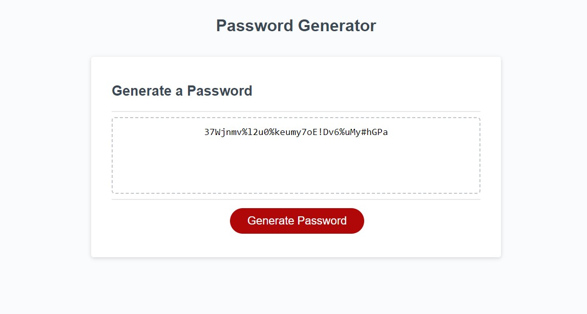

# Random Password Generator

## Description
This project is a random password generator. When the user clicks the "Generate Password" button, they will receive prompts to select the length and which types of characters they would like to include. The generator takes those responses and selects characters the desired types at random, shuffles them, then returns the password to the user. This was completed using functions within JavaScript.

## Site Preview
Below is what the webpage should look like:

## Access
This site can be accessed [here](https://noahcote10.github.io/random-password-generator/).